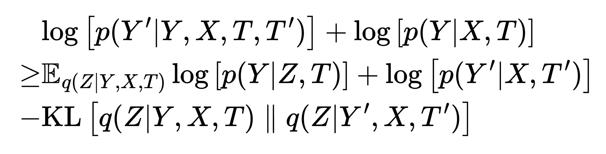

# Variational Causal Inference

This repository is the official implementation of [**Variational Causal Inference**](https://arxiv.org/abs/2209.05935).




## Installation

### 1. Create Conda Environment
```bash
conda config --append channels conda-forge
conda create -n vci-env --file requirements.txt
conda activate vci-env
```

### 2. Install Learning Libraries
- [Pytorch](https://pytorch.org/) [**1.13**.1](https://pytorch.org/get-started/previous-versions/)

  \* *make sure to install the right versions for your toolkit*


## Data

Visit our [resource site](https://osf.io/5n2mz/), download the contents of `main/datasets` into [datasets](datasets). To see how to process your own dataset, download the contents of `data-prep/datasets` into [datasets](datasets) and follow the examples. A clean example of data preparation can be found in [SciplexPrep.ipynb](datasets/SciplexPrep.ipynb). For an example of data preparation on a messier dataset with thorough analysis and visualizations, see [MarsonPrep.ipynb](datasets/MarsonPrep.ipynb).

In summary, the preparation procedure includes:

-   Quality Control

-   Normalization

-   Gene Selection

-   Field Specification

-   (Optional) Dataset Split

-   (Optional) Out-of-distribution Selection

-   (Optional) Differentially-expressed Gene Ranking


## Run
Once the environment is set up and the data are prepared, the function call to train the model is:

```bash
./main.sh &
```

A list of flags may be found in `main.sh` and `main.py` for experimentation with different network parameters. The run log and models are saved under `*artifact_path*/saves`, and the tensorboard log is saved under `*artifact_path*/runs`.


## License

Contributions are welcome! All content here is licensed under the MIT license.
